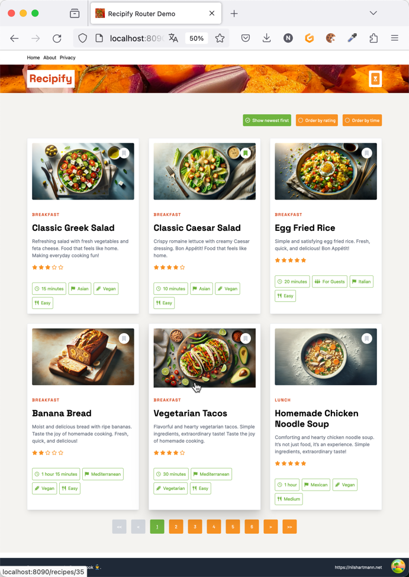

# Recipify: TanStack Router Demo


This is my sample application for the [TanStack Router](https://tanstack.com/router/v1) for React.

I recorded a video on TanStack Router that uses this demo application. You can find the [video on YouTube](https://youtu.be/KkrS_wfFq2I).




### Techstack

**Backend:**

- Java (JDK21), Spring Boot 3.2
- Postgres 16

**Frontend**

- React 18
- TypeScript
- Vite
- TanStack Router and TanStack Query
- TypeScript and zod-Code for typesafe API access is automatically generated from OpenAPI definitions.
  - You can find [more on that here](https://github.com/nilshartmann/end-to-end-typesafety-spring-boot-typescript).

## Running the backend

The backend that provides the API is implemented with Java and Spring Boot.

In order to run it, you either have to use Java or use the prebuild Docker Image.

The easiest is to use the `docker-compose-backend.yaml` file, that also starts the required Postgres database:

```
docker-compose -f docker-compose-backend.yaml up -d
```

If you're a Java ("fullstack") developer, you can launch the backend from your IDE by running the Spring Boot class `nh.recipify.TestBackendApplication`. This also automatically starts the postgres database using docker-compose. (Note that you need JDK21 and docker-compose installed)

In either way, the backend runs on http://localhost:8080.

## Running the frontend

The frontend is a Single-Page-Application built with Vite. You can run it with pnpm:

```
cd frontend
pnpm install
pnpm dev
```

The frontend runs on http://localhost:8090

### Folder structure

The folder structure in the frontend is optimized for my demo and workshop needs. It is not a good example for a real world folder structure, so please don't copy it for your own projects.

Also not that mixing TanStack Query with loaders from TanStack Router would be different in a real app. Here I mix both approaches just to show their usage. In a real project I would either go TanStack Query (for data fetching) only or use TanStack Query inside the loader of a route.

## A note on the content

The content is almost entirely generated with JetBrains AI, ChatGPT and DALL-E. You should not treat the recipes for real (unless you blindly trust AI) :-)

## Questions, comments, feedback

If you have questions or commments, please feel free to open an issue here in this directory.

You can also reach and follow me on [several platforms](https://nilshartmann.net/follow-me).
